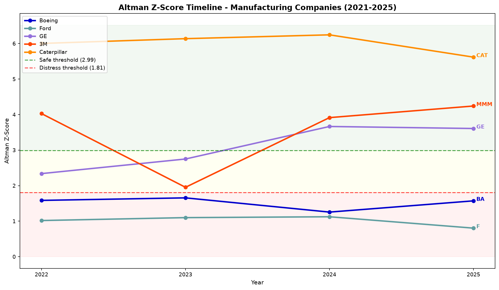
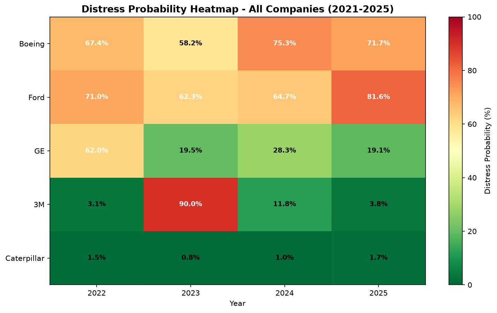
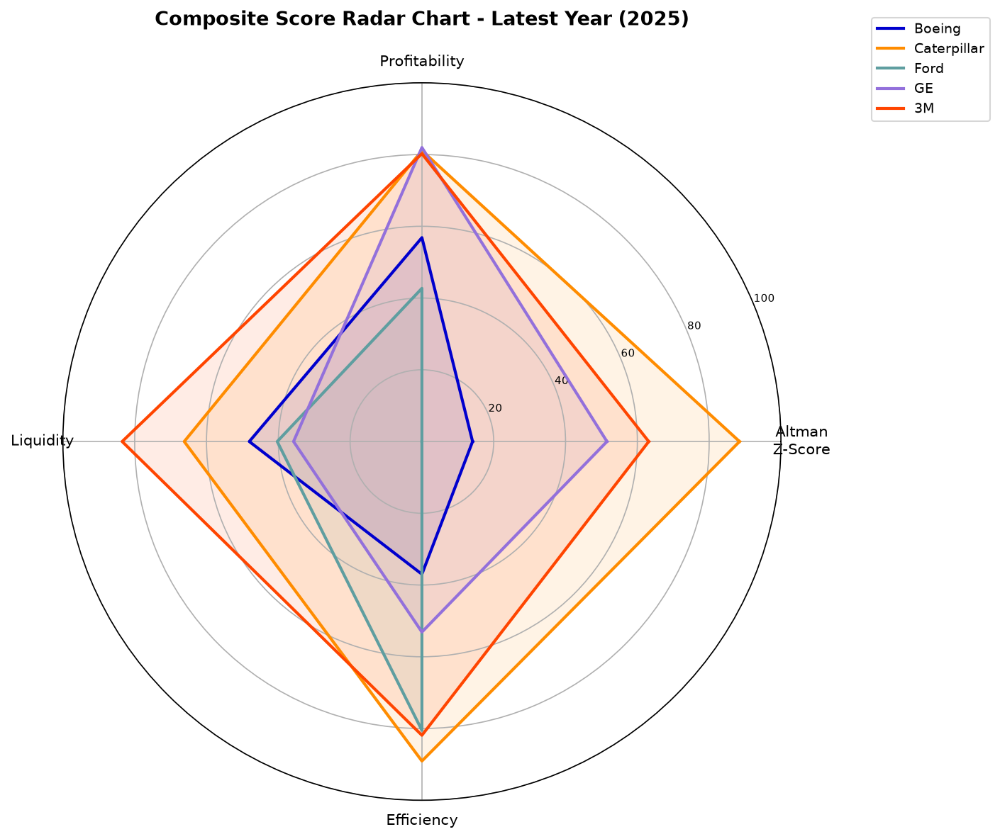
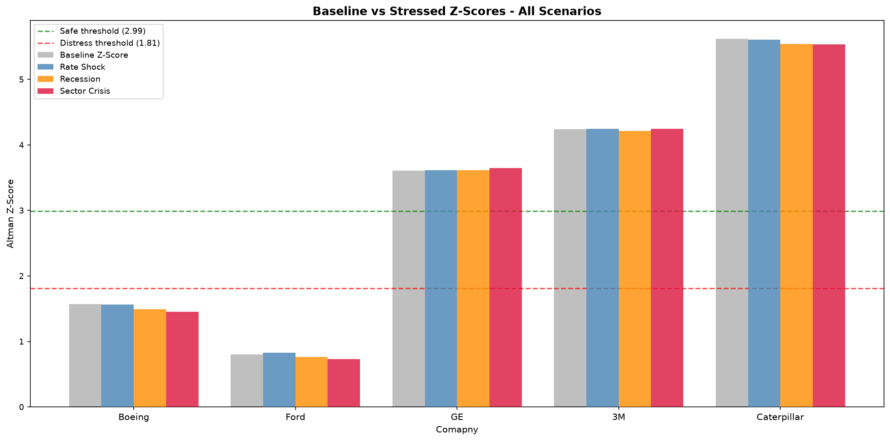
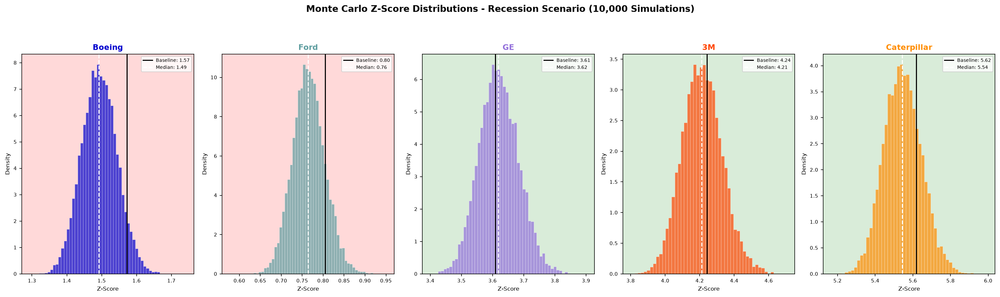

# Predictive Credit Risk Engine

This project builds a quantitative credit risk model from scratch 
using real financial statement data for five manufacturing companies. 
It implements the Altman Z-Score model, extends it with additional 
financial metrics, converts outputs to distress probabilities using 
logistic transformation, runs Monte Carlo macro stress simulations, 
and validates findings through a complete visualization suite. 

---

## Why Manufacturing Companies?

The Altman Z-Score was developed and validated specifically on 
manufacturing firms. Using Boeing (BA), Ford (F), General Electric 
(GE), 3M (MMM), and Caterpillar (CAT) means every result is 
methodologically defensible.

These five companies also span a genuine spectrum of financial health, 
from Ford deep in distress territory to Caterpillar firmly in the 
safe zone, which makes the comparisons analytically interesting rather 
than five similar companies producing similar results.

---

## Architecture
data_ingestion.py pulls financial statements from Yahoo Finance,
stores in SQLite database across 4 tables
altman_zscore.py calculates five-ratio Altman Z-Score per
company per year, classifies Safe/Grey/Distress
scoring_model.py extends Altman with profitability, liquidity,
and efficiency metrics, converts to 0-100 composite score and distress probability
stress_simulator.py runs 10,000 Monte Carlo simulations per
company per scenario under three macro stress environments
visualizations.py generates five charts saved to charts/ folder
main.py runs the complete pipeline end to end with one command: python main.py

---

## How to Run

1. Clone the repository
2. Install dependencies:
pip install yfinance pandas numpy matplotlib scipy
3. Run the full pipeline:
python main.py
4. Charts save automatically to the charts/ folder
5. Database saves to database/credit_risk.db
   
---

## Visualizations

### Altman Z-Score Timeline (2021-2025)

### Distress Probability Heatmap

### Composite Score Radar Chart

### Baseline vs Stressed Z-Scores

### Monte Carlo Distributions — Recession Scenario

---

## The Four Methods

### 1. Altman Z-Score (1968)

Calculates five financial ratios and combines them using
Edward Altman's original coefficients:
Z = 1.2(X1) + 1.4(X2) + 3.3(X3) + 0.6(X4) + 1.0(X5)

X1 = Working Capital / Total Assets        (liquidity)
X2 = Retained Earnings / Total Assets      (accumulated profitability)
X3 = EBIT / Total Assets                   (operating efficiency)
X4 = Market Cap / Total Liabilities        (leverage)
X5 = Revenue / Total Assets                (asset efficiency)

Z > 2.99  →  Safe Zone
1.81-2.99 →  Grey Zone
Z < 1.81  →  Distress Zone

### 2. Extended Composite Scoring

Normalizes the Z-Score alongside three additional metric
categories to a 0-100 scale using min-max normalization,
then combines them using weighted averaging:
Altman Z-Score:    40% weight
Profitability:     25% weight  (net profit margin, ROA)
Liquidity:         20% weight  (current ratio, FCF margin)
Efficiency:        15% weight  (asset turnover, debt-to-equity)

### 3. Distress Probability — Logistic Transformation

Converts the composite health score to a distress probability
using a logistic function:
P(distress) = 1 / (1 + e^(0.1 × (score - 50))) × 100
This produces a smooth S-curve where high composite scores
map to low distress probabilities and vice versa.

### 4. Monte Carlo Stress Simulation

For each of three macro scenarios, draws 10,000 random shock
values from normal distributions parameterized by historical
crisis magnitudes, applies them to each company's financial
metrics, and recalculates the Altman Z-Score for each
simulation. Reports the median (P50), severe (P5), and
extreme tail (P1) outcomes.

Recession:      -20% revenue, +10% costs, -10% assets
Rate Shock:     -5% revenue,  +15% costs, -5% assets
Sector Crisis:  -30% revenue, +5% costs,  -15% assets

---

## Results

### Altman Z-Score — Latest Year (2025)

| Company | Z-Score | Zone | Trend |
|---|---|---|---|
| Ford (F) | 0.805 | Distress | Declining |
| Boeing (BA) | 1.572 | Distress | Improving |
| GE | 3.609 | Safe | Stable |
| 3M (MMM) | 4.242 | Safe | Improving |
| Caterpillar (CAT) | 5.618 | Safe | Declining |

### Distress Probability Ranking (2025)

| Rank | Company | Composite Score | Distress % | Assessment |
|---|---|---|---|---|
| 1 | Ford | 35.1 | 81.6% | High Risk |
| 2 | Boeing | 40.7 | 71.7% | High Risk |
| 3 | GE | 64.4 | 19.1% | Low Risk |
| 4 | 3M | 82.3 | 3.8% | Low Risk |
| 5 | Caterpillar | 90.4 | 1.7% | Low Risk |

### Monte Carlo Stress Results — Most Vulnerable Per Scenario

| Scenario | Most Vulnerable | Baseline Z | Stressed Z | Change |
|---|---|---|---|---|
| Recession | Boeing | 1.572 | 1.492 | -0.080 |
| Rate Shock | Caterpillar | 5.618 | 5.607 | -0.011 |
| Sector Crisis | Boeing | 1.572 | 1.455 | -0.117 |

Boeing was the most vulnerable company overall with an average
Z-Score change of -0.069 across all three scenarios.

---

## Key Findings

**1. Ford and Boeing are the only high-risk companies**
Both have been in distress territory (Z < 1.81) across every
year in the dataset. Ford's distress reflects the auto
industry's capital-intensive structure and thin margins — a
known limitation of applying the Altman model to automotive
manufacturing. Boeing's distress is more specifically driven
by operational failures — the 737 MAX crisis, COVID grounding
of commercial aviation, and subsequent production quality
issues — all visible in the model's year-over-year Z-Score
deterioration.

**2. GE shows a genuine financial recovery**
GE was in the Grey Zone in 2022-2023, then crossed into the
Safe Zone in 2024-2025. This maps directly to GE's documented
restructuring — spinning off GE HealthCare in 2023 and GE
Vernova in 2024, significantly cleaning up the balance sheet.
The model captured a real corporate event without being
explicitly programmed to know about it.

**3. 3M's 2023 distress event was detected**
3M's distress probability hit 89.9% in 2023 — the year its
PFAS litigation settlements and Combat Arms earplug lawsuit
payouts wiped out net income. By 2025 it recovered to 3.8%.
The model correctly identified a temporary crisis rather than
permanent deterioration.

**4. Boeing is most vulnerable under all stress scenarios**
Under the Sector Crisis scenario (30% revenue decline),
Boeing's Z-Score drops from 1.572 to a median of 1.455, with
the 1st percentile reaching 1.265 — deep in distress
territory. Boeing is already so close to the distress boundary
that any macro shock pushes it further from recovery rather
than toward it.

**5. Caterpillar is the benchmark healthy manufacturer**
CAT's Z-Score stayed above 5.6 across all four years and
above 5.1 even in the worst stress simulation. It serves as
the clear upper benchmark — a financially robust manufacturer
with strong asset efficiency and retained earnings relative
to its asset base.

---

## SQL and Data Pipeline

Financial statement data is stored in a normalized SQLite
database across four tables — income_statement, balance_sheet,
cash_flow, and market_data. Z-Score and scoring results are
stored back into the database after calculation so downstream
modules can query them without recalculating.

Key SQL techniques used throughout:

- Multi-table JOINs to combine financial statement data
- CASE WHEN for safe division-by-zero handling
- GROUP BY with HAVING MAX() for latest-year filtering
- INSERT OR REPLACE for idempotent data loading

---

## Limitations

- The Altman Z-Score was calibrated on US manufacturing firms
  from the 1960s. Ford's persistent distress classification
  reflects a known limitation of the model for
  capital-intensive automotive manufacturing rather than
  necessarily indicating imminent bankruptcy risk
- Market cap (X4) uses current rather than historical values,
  introducing some look-ahead bias in historical year
  calculations
- Monte Carlo scenarios assume shocks are normally distributed
  and independent across variables — real macro shocks are
  often correlated and fat-tailed
- The logistic transformation weights and composite score
  weights are set by judgment rather than statistical
  calibration against known distress outcomes

---

## What I Would Build Next

- Calibrate the logistic transformation against a historical
  dataset of actual corporate distress events to validate
  the distress probability outputs
- Add Conditional Z-Score analysis — what financial metric
  improvements would move Boeing from Distress to Grey Zone?
- Extend to a multi-sector comparison using sector-adjusted
  versions of the Altman model
- Build an automated monitoring system that pulls updated
  quarterly data and flags companies whose Z-Score trend
  is deteriorating

---

## Tools Used

- Python 3.14
- yfinance — real financial statement data from Yahoo Finance
- pandas — data manipulation and SQL results handling
- NumPy — Monte Carlo simulation and array operations
- matplotlib — all five visualizations
- scipy — logistic transformation and statistical functions
- SQLite — normalized database storage and retrieval
- Git and GitHub — version control and project hosting
